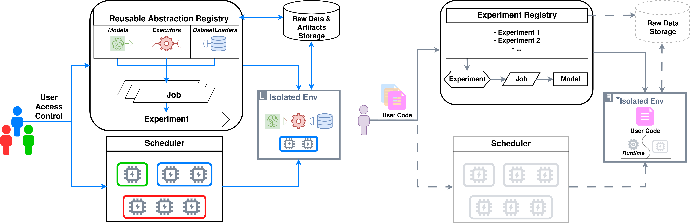

MLManagement: a cloud-native MLOps system. 
==========================================================================================

---

💎MLManagement is aimed at ensuring the full lifecycle of ML models. It is an extensible framework-agnostic tool that allows you to conduct a lot of experiments with the model: train, fine-tune, test and also serve your ML model.

##### Some of MLM's features are:
   * 🗂Versioning models and data;
   * 👨‍👧‍👧Conducting multiple experiments in a team;
   * 📈Comparing results and analysis;
   * 🥇Efficiency of implementation and operation;
   * 🔞Support for non-standard scenarios: trust-ML, data drift, etc.;

---

🖥Workflow
--------
The main workflow consists of the following stages:

   1. Prepare Wrappers for your ML model and data;
   2. Upload your Wrappers to the server;
   3. Run the experiment;
   4. Wait for the end of the experiment and analyze the results using a convenient UI;
   5. Serve your model;

---

⚙️Installation
----------------

As MLM is a cloud-native platform, all user code is stored and executed on a remote server. The interaction is carried out using the client library **ML-management**.

Install the client library via pip:

      
      pip install ML-management

To connect to a remote server, use function ``set_server_url(<URL>)``, specifying the credentials with ``set_mlm_credentials(<LOGIN>, <PASSWORD>)``

---

🛠MLOps Pipeline
----------------

MLManagement (on the left) enables collaborative MLOps pipelines with quick experiment creation via reusable building block abstractions. Other tools (on the right) have limited collaboration features and do not natively support experiment code reusability.

---

📄Documentation
---------------

User documentation available at https://mlm.at.ispras.ru/.

Tool demonstration video is available at https://youtu.be/2jJstyff_NY.
