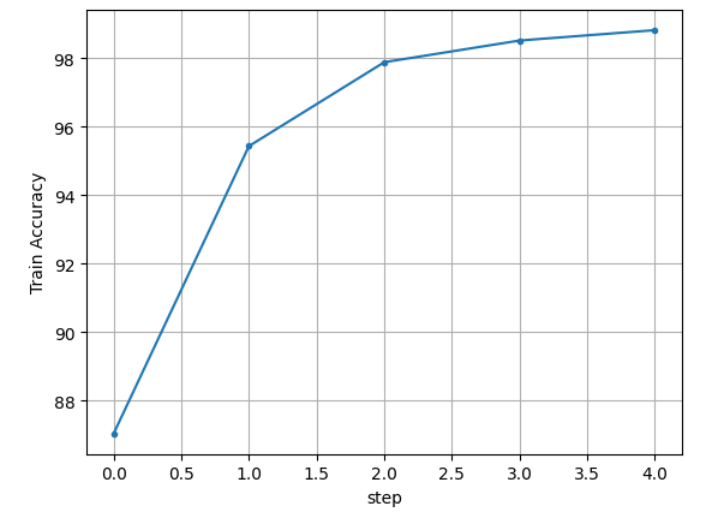

.. _base_scenario:

Base scenario [PyTorch]
=======================

We hope that you have read the :ref:`introduction <introduction>`.

Let's consider the basic scenario of using the platform when we want to train an existing model. Let's imagine that we have `ResNet18 <https://pytorch.org/vision/main/models/generated/torchvision.models.resnet18.html>`_ model, which we want to train on `MNIST <https://pytorch.org/vision/0.19/generated/torchvision.datasets.MNIST.html>`_.

ModelWrapper
------------
.. _file_structure:

First, let's organize correct file structure.

.. code::

    root
    ├── upload_model.py
    └── torch_model 
        ├── __init__.py
        ├── torch_model.py
        ├── resnet18.py
        └── conda.yaml

Simple 1-channel ResNet18 model implementation.

.. literalinclude:: ../_static/code_examples/tutorials/base_scenario/torch_model/resnet18.py
    :caption: ``torch_model/resnet18.py``
    :linenos:
    :language: python

Now we will prepare ModelWrapper. Since we want to train our :ref:`model <model>`, we need to create a :class:`~ML_management.model.patterns.trainable_model.TrainableModel` Wrapper that will implement the necessary interface.

.. _torchmodel:

.. literalinclude:: ../_static/code_examples/tutorials/base_scenario/torch_model/torch_model.py
    :caption: ``torch_model/torch_model.py``
    :linenos:
    :language: python

.. note::
    All entities that were saved during the training of the model using ``self.artifacts`` path will be saved as artifacts of the new model. Saving artifacts is valid if the executor's parameter ``upload_model_mode is not None``. For example it is valid for **train** and **fine-tune** executors.

.. literalinclude:: ../_static/code_examples/tutorials/base_scenario/torch_model/__init__.py
    :caption: ``torch_model/__init__.py``
    :linenos:
    :language: python

.. note::
    As already noted, you can pass arguments to *__init__* function of model just like train_function. Only condition that arguments of *__init__* function of model match arguments of *get_object* function. If they do not match you can still upload your model, but you would not be able to pass arguments.

.. literalinclude:: ../_static/code_examples/tutorials/base_scenario/torch_model/conda.yaml
    :caption: ``torch_model/conda.yaml``
    :linenos:

So, let's upload our model to a remote server (**don't forget to provide your remote server url and credentials!**).

.. literalinclude:: ../_static/code_examples/tutorials/base_scenario/upload_model.py
    :caption: ``upload_model.py``
    :linenos:
    :language: python
    :lines: 2-

The :mod:`~ML_management.mlmanagement.log_api.log_model_src` function returns the :class:`~ML_management.mlmanagement.metainfo.ObjectMetaInfo`, which contains some information about the uploaded model, in particular a hash of artifacts.

.. note::
    If you try to upload a duplicate version of an existing model, the function will return information about it and the duplicate will not be uploaded. If you still need to upload a duplicate, then use the flag force=True.

Let's download the model from the server.

.. literalinclude:: ../_static/code_examples/tutorials/base_scenario/load_model.py
    :caption: ``load_model.py``
    :linenos:
    :language: python
    :lines: 2-

The :mod:`~ML_management.mlmanagement.log_api.load_model` function returns a :class:`~ML_management.mlmanagement.metainfo.LoadedObject` that contains information about the local path to the loaded model, the initialized model class, and meta information about it.

.. note::
    By default, caching of uploaded models in the ``$HOME/.mlm_registry_cache`` directory is enabled. This means that when loading models, the cache will be checked first, and if it is missing, it will be downloaded from the server. In order to disable caching or change the directory, you need to use the :mod:`~ML_management.mlmanagement.backend_api.set_no_cache_load` or :mod:`~ML_management.mlmanagement.backend_api.set_local_registry_path` functions, or set environment variables to NO_CACHE and LOCAL_REGISTRY_PATH, respectively.
.. note::
    See also :mod:`~ML_management.sdk.model.list_model`, :mod:`~ML_management.sdk.model.list_model_version`, :mod:`~ML_management.sdk.model.delete_model`, :mod:`~ML_management.sdk.model.delete_model_version`, :mod:`~ML_management.sdk.model.get_model_version`, :mod:`~ML_management.sdk.model.set_model_tags`, :mod:`~ML_management.sdk.model.delete_model_tag`.

.. _data_wrapper:

DataWrapper
-----------

Now we can prepare the :ref:`data <data>` for our model.

.. code::

    root
    ├── upload_data.py
    └── data 
        ├── __init__.py
        ├── data.py
        └── conda.yaml

.. literalinclude:: ../_static/code_examples/tutorials/base_scenario/data/data.py
    :caption: ``data/data.py``
    :linenos:
    :language: python
.. _mnist_wrapper:
.. literalinclude:: ../_static/code_examples/tutorials/base_scenario/data/__init__.py
    :caption: ``data/__init__.py``
    :linenos:
    :language: python

.. literalinclude:: ../_static/code_examples/tutorials/base_scenario/data/conda.yaml
    :caption: ``data/conda.yaml``
    :linenos:

The :ref:`DatasetLoader <dataset_loader>` also needs to be initialized and uploaded to the server.

.. literalinclude:: ../_static/code_examples/tutorials/base_scenario/upload_data.py
    :language: python
    :caption: ``upload_data.py``
    :linenos:
    :lines: 2-

We will also upload raw data (from local directory ``./mnist``) to the remote storage using :class:`~ML_management.s3.manager.S3Manager`'s method :mod:`~ML_management.s3.manager.S3Manager.upload`. This data will be downloaded to the execution container using the supported :ref:`Сollector <collector>`.

.. literalinclude:: ../_static/code_examples/tutorials/base_scenario/s3_upload.py
    :language: python
    :linenos:
    :lines: 2-

To download data from remote s3 use :class:`~ML_management.s3.manager.S3Manager`'s method :mod:`~ML_management.s3.manager.S3Manager.set_data`

.. literalinclude:: ../_static/code_examples/tutorials/base_scenario/s3_download.py
    :language: python
    :linenos:
    :lines: 2-

.. note::
    The parameter `sync` is responsible for synchronization of remote bucket and local directory. With this option method :mod:`~ML_management.s3.manager.S3Manager.set_data` recursively copies new and updated files from the remote s3 to local destination.

.. note::
    See also :mod:`~ML_management.sdk.dataset_loader.list_dataset_loader`, :mod:`~ML_management.sdk.dataset_loader.list_dataset_loader_version`, :mod:`~ML_management.sdk.dataset_loader.delete_dataset_loader`, :mod:`~ML_management.sdk.dataset_loader.delete_dataset_loader_version`, :mod:`~ML_management.sdk.dataset_loader.set_dataset_loader_tags`, :mod:`~ML_management.sdk.dataset_loader.delete_dataset_loader_tag`.

Job
---

Now we can create a task to train the **BlackWhiteResNet18** model on the **MNIST** dataset.

.. literalinclude:: ../_static/code_examples/tutorials/base_scenario/add_ml_job.py
    :language: python
    :lines: 2-
    :linenos:

Your can monitor the status of the task using :ref:`sdk <sdk>`: ``ML_management.sdk.job_by_name(job_name).status``. 

Also, you can view job execution logs:

.. literalinclude:: ../_static/code_examples/tutorials/base_scenario/get_job_logs.py
    :lines: 2-
    :language: python
    :linenos:

After completing the job, we can view the list of available metrics, as well as the history of a specific metric:

.. literalinclude:: ../_static/code_examples/tutorials/base_scenario/get_available_metrics.py
    :lines: 2-
    :linenos:

.. literalinclude:: ../_static/code_examples/tutorials/base_scenario/get_available_metrics_output.txt
    :linenos:

.. literalinclude:: ../_static/code_examples/tutorials/base_scenario/get_job_metrics.py
    :lines: 2-
    :linenos:

.. csv-table:: 
   :file: ../_static/code_examples/tutorials/base_scenario/get_job_metrics_output.csv
   :widths: 20, 30, 30, 30
   :header-rows: 1

.. literalinclude:: ../_static/code_examples/tutorials/base_scenario/get_metric_history.py
    :lines: 2-
    :linenos:

.. literalinclude:: ../_static/code_examples/tutorials/base_scenario/get_metric_history_output.txt
   :linenos:

.. note::
    There are some sdk functions that will help you to learn more about your job. See also: :mod:`~ML_management.sdk.job.job_by_name`, :mod:`~ML_management.sdk.job.available_metrics`, :mod:`~ML_management.sdk.job.job_metric_by_name`, :mod:`~ML_management.sdk.job.metric_history`, :mod:`~ML_management.sdk.job.cancel_job`, :mod:`~ML_management.sdk.job.get_logs`.

To learn more sdk features, follow the :ref:`link <sdk>`.