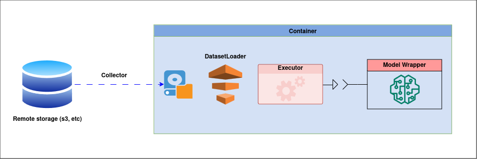

.. _introduction:

Introduction
============

We introduce 3 basic concepts in the platform: :ref:`Executor <executor>` (meta-algorithm which interacts with the model), :ref:`Model Wrapper <model>` and :ref:`DatasetLoader <data>`.

.. _executor:

Executor
--------
ML-models are often interacted with in the following way: they are trained/retrained/tested on selected data. There are also some specific ways to interact with the model: for example the model can be defended or attacked. At the same time, if we apply restrictions on the model's interfaces, then the upper-level interaction with the model will often be arranged in a similar way.

For example, during training of the model you need to:
    * select data
    * call the *train_function* with the selected data
    * log metrics
    * save the model

The platform provides :ref:`"Executor" <executor_base>`-s - entities that interact with the model: perform training, validation and testing, carry out attacks, and counteract vulnerabilities of ML-models. In fact, the executor declares the model interfaces, which necessary for implementation by the user, for example, it can be the *some_function* method.

\

.. warning::
    In order to formalize this logic (to require the model to have some methods), the model class must be inherited from at least one of the abstract classes offered by the platform.
    So, the abstract class :class:`~ML_management.model.patterns.evaluatable_model.EvaluatableModel` requires the *evaluate_function* method, the abstract class :class:`~ML_management.model.patterns.trainable_model.TrainableModel`: *train_function*, the abstract class :class:`~ML_management.model.patterns.retrainable_model.RetrainableModel`: *finetune_function*, etc.

**Thus, executors require that the model be inherited from some abstract classes, which in turn require the implementation of some methods necessary for the interaction of the model with the platform.**

.. _model:

Model Wrapper
-------------
The model in the platform is framework-agnostic wrapper over your model. In the wrapper, you only need to define a model and implement an interface for interacting with the executor, for example, some_function. Metrics are also logged using the client library. As we have already noted, the model code is executed on a remote server, so after initialization, you need to upload the model wrapper to the server.

For example, if we want to train a model, then we need to implement the *train_function(...)* interface with typed args.

As we described in :ref:`Remote Job <remote_job>`, we need to organize the folder structure correctly.

.. code::

    root
    ├── upload_model.py
    └── model 
        ├── __init__.py
        ├── model.py
        └── conda.yaml

.. literalinclude:: ../_static/code_examples/tutorials/introduction/model/model.py
    :caption: ``model/model.py``
    :language: python
    :linenos:

.. note::
    You can pass arguments to *__init__* function of model just like *train_function*. Only condition that arguments of *__init__* function of model match arguments of *get_object* function. If they do not match you can still upload your model, but you would not be able to pass arguments.

.. literalinclude:: ../_static/code_examples/tutorials/introduction/model/__init__.py
    :caption: ``model/__init__.py``
    :language: python
    :linenos:

.. literalinclude:: ../_static/code_examples/tutorials/introduction/model/conda.yaml
    :caption: ``model/conda.yaml``
    :linenos:

Now we can upload our model wrapper.

.. literalinclude:: ../_static/code_examples/tutorials/introduction/upload_model.py
    :caption: ``upload_model.py``
    :linenos:

Thus, the **train** executor will be able to access the *train_function* interface of the model.

\

.. note::
    One model can be suitable for several executors, one executor can be suitable for many models, and an executor can also work with several models (for example, in attack-defense tasks)

    .. image:: ../_static/images/ExecutorModel2.png
        :align: center
        :width: 800px

.. _data:

Data
----
Data is an essential part of any machine learning pipeline. We introduce the concept of **DatasetLoader** to standardize the process of model's interaction with data.

It is necessary to inherit the Wrapper of your **DatasetLoader** from the abstract :class:`~ML_management.dataset_loader.dataset_loader_pattern.DatasetLoaderPattern` class.
**DatasetLoader** provides model with data for interaction by implementing the *get_dataset(...)* interface.

We also have to follow a certain structure to load the data, same as for the model.

.. code::

    root
    ├── upload_data.py
    └── data 
        ├── __init__.py
        ├── data.py
        └── conda.yaml

.. literalinclude:: ../_static/code_examples/tutorials/introduction/data/data.py
    :language: python
    :linenos:
    :caption: ``data/data.py``

.. note::
    Executor provides DatasetLoader with raw data using ``self.data_path``.

.. literalinclude:: ../_static/code_examples/tutorials/introduction/data/__init__.py
    :language: python
    :linenos:
    :caption: ``data/__init__.py``

.. literalinclude:: ../_static/code_examples/tutorials/introduction/data/conda.yaml
    :linenos:
    :caption: ``data/conda.yaml``

Now we can upload our data wrapper.

.. literalinclude:: ../_static/code_examples/tutorials/introduction/upload_data.py
    :caption: ``upload_data.py``
    :linenos:

**DatasetLoader** reads the raw data in the format required by the model. However, as we have already noted, tasks are performed on a remote server, in a single execution container, so it is necessary to provide raw data to this container. This is handled by the :class:`~ML_management.collectors.collector_pattern.CollectorPattern` (another core element of the platform).

\

.. note::
    The **main idea** of introducing these entities is that it will allow the user to create a universal building blocks when with one loaded model (and the implementation of the necessary interfaces). You can create many tasks on different datasets, just as you can test multiple models with a single dataset, without having to modify the code.

\

.. _pipeline:

Pipeline
--------

    1. For each task, a single execution container is created on a remote server.
    2. **Collector** puts the raw data from the remote storage into the execution container.
    3. **Executor**, using the **DatasetLoader**, prepares data for the model.
    4. **Executor** accesses the **Model** interface.

\
